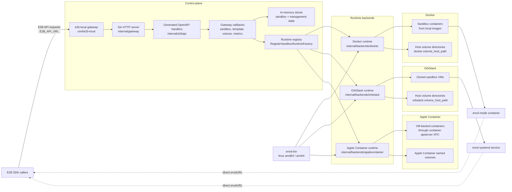

# e2b-local

[Chinese version](README.zh-CN.md)

`e2b-local` is a local E2B-compatible gateway written in Go. It accepts requests from E2B SDKs and runs sandboxes on local infrastructure:

- Docker containers through the Docker Engine API
- OrbStack Linux VMs through the OrbStack CLI
- Apple Container through its native XPC services on macOS

The HTTP layer follows the E2B OpenAPI schema where practical, while runtime-specific work lives behind Docker, OrbStack, and Apple Container backend packages.

## Quick Start

Copy the default config:

```bash
cp config.example.yaml config.yaml
```

The default runtime is Docker. Start the gateway:

```bash
go run ./cmd/e2b-local --config config.yaml
```

Create a volume through the CLI:

```bash
go run ./cmd/e2b-local volume create --config config.yaml test-volume
```

The command reuses the configured runtime and returns the same JSON shape as `POST /volumes`, for example:

```json
{"volumeID":"test-volume","name":"test-volume","token":"compat-volume-token-test-volume"}
```

## Architecture



The gateway handles E2B-compatible control-plane APIs such as sandbox lifecycle, templates, volumes, snapshots, metrics, and logs. After a sandbox is created, SDK calls for commands, filesystem, PTY, and streaming use the sandbox-specific `envdURL` returned by the runtime.

## Use From E2B SDKs

Point the E2B SDK at the local gateway instead of the hosted E2B API:

```bash
export E2B_API_URL="http://127.0.0.1:3000"
export E2B_API_KEY="local"
unset E2B_SANDBOX_URL
```

`E2B_API_KEY` is kept for SDK compatibility. The local gateway does not require a real hosted E2B key.

Template IDs are local runtime IDs:

- Docker runtime exposes tagged local Docker images as templates. For example, `e2b-local/code-interpreter:latest` is available as `code-interpreter`.
- OrbStack runtime exposes existing OrbStack machines, or configured template IDs, as templates.
- Apple Container runtime exposes configured template IDs mapped to locally pulled OCI images.
- Call `ListTemplates` from the SDK, or `GET /templates`, to see the exact IDs available on the current machine.

JavaScript or TypeScript callers:

```ts
import { Sandbox, Volume } from 'e2b'

const template = 'code-interpreter'
const sandbox = await Sandbox.create(template)

try {
  const result = await sandbox.commands.run('echo "hello from e2b-local"')
  console.log(result.stdout)
} finally {
  await sandbox.kill()
}

const volume = await Volume.create('my-data')
const withVolume = await Sandbox.create(template, {
  volumeMounts: {
    '/mnt/data': volume,
  },
})
await withVolume.kill()
```

Go callers can use [superduck-ai/e2b-go-sdk](https://github.com/superduck-ai/e2b-go-sdk):

```go
package main

import (
	"context"
	"fmt"

	e2b "github.com/superduck-ai/e2b-go-sdk"
)

func main() {
	ctx := context.Background()
	template := "code-interpreter"

	sandbox, err := e2b.Create(ctx, template, nil)
	if err != nil {
		panic(err)
	}
	defer sandbox.Kill(ctx, nil)

	result, err := sandbox.Commands.Run(ctx, `echo "hello from e2b-local"`, nil)
	if err != nil {
		panic(err)
	}
	fmt.Println(result.(*e2b.CommandResult).Stdout)

	volume, err := e2b.CreateVolume(ctx, "my-data", nil)
	if err != nil {
		panic(err)
	}
	defer e2b.DestroyVolume(ctx, volume.VolumeID, nil)

	withVolume, err := e2b.Create(ctx, template, &e2b.SandboxOpts{
		VolumeMounts: map[string]any{
			"/mnt/data": volume,
		},
	})
	if err != nil {
		panic(err)
	}
	defer withVolume.Kill(ctx, nil)
}
```

Runtime notes for callers:

- Docker volumes are managed local directories under `docker.volume_host_path`; sandbox creation bind-mounts them at the requested paths.
- OrbStack volumes are directories under `orbstack.volume_host_path` and are mounted into sandbox VMs on demand.
- Apple Container volumes are Apple Container native named volumes and are mounted during sandbox creation.
- The SDK receives a direct `envdURL` for each sandbox, so commands, filesystem, PTY, and streaming calls talk directly to the sandbox runtime after creation.

## Status

Implemented capabilities include:

- Gin-based HTTP server and middleware.
- Config-driven local runtime selection.
- Generated request/response DTOs, client types, and server interfaces from the E2B OpenAPI schema.
- E2B sandbox lifecycle APIs: create, list, get, kill, pause, resume, connect, and logs.
- Template, build, volume, snapshot, and metrics resource endpoints.
- Docker runtime for creating, pausing, resuming, deleting, restoring, logging, and collecting stats from real containers.
- OrbStack runtime for cloning/starting/stopping/deleting VMs through OrbStack sockets, installing `envd` as a systemd service, managing volume mounts, and creating snapshots without shelling out to the OrbStack CLI.
- Apple Container runtime for creating, pausing, resuming, deleting, restoring, and mounting volumes through `container-apiserver` XPC without shelling out for sandbox lifecycle operations.

## Repository Layout

- `cmd/e2b-local`: CLI entrypoint for serving the gateway and helper commands.
- `internal/gateway`: core gateway package with config, routes, store, callbacks, and runtime interfaces.
- `internal/backends/docker`: Docker runtime implementation.
- `internal/backends/orbstack`: OrbStack VM runtime implementation.
- `internal/backends/applecontainer`: Apple Container XPC runtime implementation.
- `internal/e2bapi`: generated OpenAPI client/server/DTO code.
- `envd-bin`: checked-in Linux `envd` binaries used by Docker, OrbStack, and Apple Container.
- `scripts`: local smoke-test and helper scripts.
- `tests/sdk_integration`: optional Go/JS SDK integration tests.

Backends register themselves through `RegisterSandboxRuntimeFactory`, so runtime logic stays outside the HTTP router.

## Requirements

- Go 1.25 or newer.
- Docker, OrbStack, or Apple Container, depending on the selected runtime.
- A compatible Linux `envd` binary from `envd-bin`.

The repository tracks:

- `envd-bin/envd-linux-amd64`
- `envd-bin/envd-linux-arm64`

Docker inspects the selected image architecture and bind-mounts the matching `envd` binary into each sandbox container at `/usr/local/bin/envd`. OrbStack copies the configured binary into each sandbox VM and installs it as `/usr/local/bin/envd` before starting the systemd service. Apple Container copies the configured binary into each VM-backed container with XPC `copyIn` unless the selected template sets `prebaked_envd_path`, then starts envd as a container process.

## Configuration

See `config.example.yaml` for the full local config shape. Use `config.docker.yaml` for a Docker-focused example, `config.orb.yaml` for an OrbStack-focused example, and `config.applecontainer.yaml` for an Apple Container example.

A compact Docker config:

```yaml
server:
  addr: "0.0.0.0:3000"

traffic:
  # Empty means e2b-local detects the outbound interface IP on startup.
  # advertised_host: "192.168.1.10"
  # Optional: force a host interface, for example when VPN/TUN software changes
  # the default route on macOS.
  # interface: "en0"
  advertised_probe_addr: "8.8.8.8:80"

runtime:
  type: "docker"

docker:
  container_name_prefix: "e2b-envd-"
  published_ports: [5000]
  published_host_ip: "0.0.0.0"
  health_timeout_seconds: 30
  # Enabled by default: expose /dev/fuse and grant SYS_ADMIN to each sandbox.
  enable_fuse: true
```

Important fields:

- `runtime.type` supports `docker`, `orbstack`, and `applecontainer`.
- `docker.host` can be omitted. The gateway uses `DOCKER_HOST`, then the current user's OrbStack socket when present, then `unix:///var/run/docker.sock`.
- Docker templates are discovered from tagged local Docker images. The gateway never pulls images; pull, build, and tag them locally before creating sandboxes.
- `traffic.advertised_host` is the IP or host returned by sandbox port lookups. Empty means the gateway detects it on startup. `traffic.interface` can force a host interface such as `en0`; otherwise macOS falls back to UDP probing, while Linux tries netlink route detection before UDP probing.
- `docker.platform` is optional. Empty means Docker chooses the image platform, then the gateway inspects the selected image.
- `docker.envd_binary` is optional. Empty means the gateway picks `envd-bin/envd-linux-amd64` or `envd-bin/envd-linux-arm64` from the selected image architecture. When set, it can be relative to the config file.
- `docker.volume_host_path` stores managed local volume directories and supports `~` and config-relative paths.
- `docker.published_ports` publishes business ports such as `5000` from every sandbox on dynamic host ports. `docker.published_host_ip` defaults to `0.0.0.0` for LAN access.
- `docker.enable_fuse` is enabled by default. Sandboxes receive `/dev/fuse` and the `SYS_ADMIN` capability so they can mount FUSE filesystems; set it to `false` to disable this behavior. This is a powerful capability and should only be used with trusted sandboxes.
- `orbstack.envd_binary` can be relative to the config file. The gateway copies it into each VM before installing the service.
- `orbstack.volume_host_path` stores local volume directories on macOS and supports `~` and config-relative paths.
- `applecontainer.envd_binary` can be relative to the config file. The gateway copies it into Apple Container sandboxes unless the selected template sets `prebaked_envd_path`.
- `applecontainer.templates` maps local template IDs to Apple Container image references. The gateway does not pull images; pull them with `container image pull` first.

### Advertised Host Detection

Docker business port URLs use the host selected by the `traffic` config. The startup resolution order is:

1. `traffic.advertised_host`, when set, is used as-is.
2. `traffic.interface`, when set, must name a host interface with a usable IPv4 address. If it cannot be resolved, startup fails instead of silently falling back.
3. On Linux, e2b-local uses netlink route lookup for `traffic.advertised_probe_addr` and advertises the selected route source/interface IP.
4. The final fallback is UDP probing with `traffic.advertised_probe_addr`.

On macOS with VPN/TUN software such as Surge, route lookup for public addresses may select `utun*`. For LAN access, set `traffic.interface: "en0"` or set `traffic.advertised_host` to the exact LAN IP.

### Docker Business Ports

`docker.published_ports` publishes the same container port from every sandbox on a different Docker-assigned host port. For example, two sandboxes can both listen on container port `5000`, while Docker exposes them as `192.168.1.10:38123` and `192.168.1.10:39201`.

Resolve a published port with:

```bash
curl http://127.0.0.1:3000/sandboxes/<sandboxID>/ports/5000
```

Example response:

```json
{
  "containerPort": 5000,
  "host": "192.168.1.10",
  "hostPort": 38123,
  "url": "http://192.168.1.10:38123",
  "wsUrl": "ws://192.168.1.10:38123",
  "protocol": "tcp"
}
```

Unpublished ports return `404` with a message pointing at `docker.published_ports` or Dockerfile `EXPOSE`.

## Docker envd Helper

To run a standalone envd container for manual debugging:

```bash
scripts/start-docker-envd.sh
```

Defaults:

- image: `e2b-local/code-interpreter:latest`
- standalone container platform: `linux/amd64`
- envd binary: selected from `envd-bin` based on the helper platform
- container name: `e2b-envd`
- external URL: `http://127.0.0.1:49984`

Useful overrides:

```bash
E2B_ENVD_HOST_PORT=49985 \
E2B_ENVD_CONTAINER=e2b-envd-2 \
scripts/start-docker-envd.sh
```

## Docker Runtime

Use Docker runtime when you want the gateway to create one container per sandbox:

```yaml
runtime:
  type: "docker"
```

In Docker runtime:

- `POST /sandboxes` creates a container.
- `DELETE /sandboxes/{sandboxID}` removes the container.
- `pause` and `connect` map to Docker pause/unpause.
- envd listens on container port `49983`; Docker publishes a separate localhost host port for each sandbox automatically.
- Templates are resolved from local tagged Docker images, or from a full image reference passed as `templateID`. The image must already exist locally.
- The gateway stores non-sensitive runtime metadata in `e2b.local.*` container labels and restores running/paused sandboxes after process restart.
- The selected envd binary is mounted at `/usr/local/bin/envd`.
- With `docker.enable_fuse: true`, the gateway injects `/dev/fuse` and `SYS_ADMIN`; the template image must still install `fuse3`, `libfuse2`, or the specific FUSE program.
- Requested E2B volumes are local directories under `docker.volume_host_path` and are bind-mounted into sandbox containers.
- Sandbox responses return the direct runtime `envdURL` assigned by Docker.
- Business ports declared with `docker.published_ports` or Dockerfile `EXPOSE` can be resolved with `GET /sandboxes/{sandboxID}/ports/{port}`. The response includes `url` and `wsUrl`, for example `http://192.168.1.10:38123`.

Example sandbox request:

```json
{
  "templateID": "code-interpreter",
  "volumeMounts": [
    {
      "name": "my-data",
      "path": "/mnt/data"
    }
  ]
}
```

## OrbStack Runtime

Use OrbStack runtime when each sandbox should run inside a full Linux VM:

```yaml
runtime:
  type: "orbstack"

orbstack:
  machine_name_prefix: "e2b-sandbox-"
  envd_binary: "envd-bin/envd-linux-arm64"
  envd_port: 49983
  volume_host_path: "~/.e2b-local/volumes"
```

In OrbStack runtime:

- Existing OrbStack machines whose names do not start with `machine_name_prefix` are exposed as templates.
- Sandbox creation clones the selected template machine.
- The gateway copies `envd_binary` into the VM and installs `/usr/local/bin/envd`.
- envd runs as a systemd service inside the VM.
- Sandbox envd URLs prefer the VM IP and fixed `envd_port`.
- `orbstack.isolated: true` prevents sandbox VMs from seeing the full macOS filesystem.
- Volumes are exposed through OrbStack selective mounts and symlinked to the requested paths inside the VM.
- Snapshots are created by cloning the VM through OrbStack's socket RPC.

## Apple Container Runtime

Use Apple Container runtime on Apple Silicon macOS when each sandbox should run as an Apple Container VM-backed container:

```yaml
runtime:
  type: "applecontainer"

applecontainer:
  container_name_prefix: "e2b-sandbox-"
  envd_binary: "envd-bin/envd-linux-arm64"
  envd_port: 49983
  templates:
    debian-bookworm-slim:
      image: "docker.io/library/debian:bookworm-slim"
      # Set this when envd is already baked into the image.
      # prebaked_envd_path: "/usr/local/bin/envd"
```

System prerequisites:

```bash
export CGO_ENABLED=1
brew install container
brew services start container
container system status
container system kernel set --recommended
container image pull --platform linux/arm64 docker.io/library/debian:bookworm-slim
```

Notes:

- The Apple Container backend requires macOS with cgo enabled because the native XPC bridge is compiled through cgo.
- Apple Container must report `status running`; the backend talks to `com.apple.container.apiserver` and `com.apple.container.core.container-core-images` directly through XPC.
- A default kernel is required. If `container run` reports `default kernel not configured`, run `container system kernel set --recommended`.
- Template images must already be pulled with Apple Container. Lifecycle-only smoke tests can use small images such as Alpine, but E2B SDK command execution needs an image with `/bin/bash`; `debian:bookworm-slim` works.
- envd is copied from `applecontainer.envd_binary` unless the selected template sets `prebaked_envd_path`.
- envd is exposed with an explicit published localhost port because Apple Container does not allocate `hostPort: 0`; the runtime retries with a fresh port when Apple Container reports a port conflict.
- `pause` maps to Apple Container stop, and `resume` bootstraps the existing container and reuses the persisted published port.
- Volumes use Apple Container named volumes and are mounted with the requested `VolumeMounts` during sandbox creation.

Capability matrix:

| Capability | Apple Container backend |
| ---------- | ----------------------- |
| Create/pause/resume/delete/restore | Supported |
| Commands, filesystem, PTY, Git | Supported through direct `envdURL` |
| Volume create/list/get/delete | Supported with Apple Container named volumes |
| Volume mounts | Supported at sandbox creation |
| Snapshots | Not supported |
| Runtime network updates | Not supported |

## Tests

Run regular tests:

```bash
go test ./...
```

Optional JS SDK integration test:

```bash
go test -tags=js_sdk_integration -run TestJSSDKGatewaySmoke -count=1 -v
```

Optional Go SDK integration tests:

```bash
go test -tags=go_sdk_integration -run 'TestGoSDKGatewayMVP|TestGoSDKGatewayFilesystemDirectEnvd|TestGoSDKGatewayVolumeLifecycle' -count=1 -v
```

Optional Apple Container integration tests:

```bash
go test -tags=integration ./internal/backends/applecontainer/... -count=1 -v
go test -tags=go_sdk_integration ./tests/sdk_integration -run TestGoSDKGatewayAppleContainerDirectEnvd -count=1 -v
```

Most SDK integration tests read `config.yaml` through `LoadConfig("config.yaml")` and skip when Docker, envd, Node, or SDK dependencies are unavailable. `TestGoSDKGatewayAppleContainerDirectEnvd` builds its own Apple Container config and skips unless `container-apiserver`, the configured envd binary, and the template image are available.
