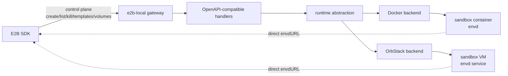

# 把 E2B Sandbox 跑在本地：e2b-local 的设计与实现

E2B 提供了一套很好用的 sandbox API：开发者可以通过 SDK 创建沙箱、执行命令、读写文件、打开 PTY，并把这些能力封装进自己的产品或开发工具里。

但在项目早期，另一个问题会很快出现：如果每次调试 template 都要走一次完整的远端构建和发布流程，反馈链路就会变得很长。改一个系统包、调一个启动命令、修一个 ready check，都需要等待镜像构建、上传、部署，再重新创建 sandbox。

`e2b-local` 想解决的是这个开发阶段的问题：让 E2B SDK 面向同一套 API，但把 sandbox 跑在本机的 Docker 容器或 OrbStack Linux VM 里。

它不是要替代云端 E2B，而是补上一个更短的本地开发闭环。

## 为什么要把 sandbox 放到本地

我做这个项目最直接的原因有两个。

第一个是 template 调试。项目早期 template 会频繁变化：依赖要调整，基础镜像要换，启动命令要试，文件布局也常常会改。如果每一次变化都需要重新构建远端 E2B 镜像，开发节奏会被构建流程切碎。

本地 runtime 的价值在这里非常明显：镜像已经在本机，就直接创建 sandbox；VM 已经在本机，就直接 clone 一个新的 sandbox。失败了看日志，改完再来一次，反馈速度接近普通本地开发。

第二个是本地网络。调试 sandbox 时，经常需要访问开发机上的服务，例如本地 API server、mock server、数据库、还没有发布出去的内部服务。远端 sandbox 很难自然访问你的 `localhost`，而本地 Docker 或本地 VM 更容易接入这些开发环境。

所以 `e2b-local` 的目标可以概括成一句话：

> 保持 E2B SDK 的调用方式，同时把 template、网络、日志和 runtime 都拉回开发者机器上。

## 本地 Docker 和云上 template 的关系

云上的 E2B sandbox runtime 基于 Firecracker microVM。用户可以基于自定义 Docker 镜像构建自己的 E2B template，但目标平台是 Linux x86-64，也就是 Docker 里的 `linux/amd64`。

这也是 `e2b-local` 优先支持 Docker runtime 的原因之一。我们本地调试时同样使用 `linux/amd64` Docker 镜像，让本地 sandbox 尽量贴近最终会被打包成 E2B template 的形态。在 macOS 上，不管是 Docker 还是 OrbStack，对这条链路的支持都比较顺：开发者可以在本机 build/tag 镜像，用 `e2b-local` 创建 sandbox 验证启动命令、系统依赖和 SDK 行为，然后再把同一个思路打包到云上的 E2B template 流程里。

换句话说，本地 Docker runtime 不是另起一套完全不同的开发模型，而是把“自定义 Docker 镜像 -> E2B template”这条链路提前放到开发机上验证。

一个比较自然的本地到云上流程是：

```bash
docker buildx build \
  --platform linux/amd64 \
  -t e2b-local/code-interpreter:latest \
  --load .
```

然后用 `e2b-local` 从这个本机 image 创建 sandbox，验证 envd 是否能启动、SDK commands/filesystem/PTY 是否正常、start command 和 ready command 是否符合预期。等这些都在本地跑通以后，再把同一套 Dockerfile 或 image 构建逻辑接到云上的 E2B template 流程里。

## 先分清控制面和数据面

E2B 的接口看起来都来自 SDK，但实际可以分成两类。

第一类是控制面。比如创建、查询、暂停、恢复、删除 sandbox，列出 templates，管理 volumes，读取 logs 和 metrics。这些请求适合由本地 gateway 接住，再翻译成本地 runtime 操作。

第二类是数据面。比如：

```text
commands.run(...)
files.write/read/list(...)
pty.create/sendInput/wait(...)
```

真正执行命令、读写文件、维护 PTY 的不是 gateway，而是 sandbox 内部的 `envd`。因此 `e2b-local` 的设计不是把所有流量都代理到 gateway 后面，而是在创建 sandbox 时返回这个 sandbox 自己的 `envdURL`。SDK 后续的数据面调用会直接访问对应 sandbox 的 envd。

整体链路大概是这样：



这个拆分决定了项目的边界：

- gateway 负责 E2B 兼容的控制面协议。
- Docker / OrbStack backend 负责创建真实的本地执行环境。
- sandbox 内部的 envd 负责命令、文件、PTY 和 streaming。
- SDK 不需要知道底层到底是容器还是 VM。

## Gateway：尽量兼容 E2B SDK

`e2b-local` 是一个 Go 写的本地 gateway。HTTP 层使用 Gin，E2B API 的 request / response DTO 来自 OpenAPI schema，并通过 `oapi-codegen` 生成到 `internal/e2bapi`。

这么做的原因很朴素：SDK 兼容是这个项目最重要的边界。相比手写一套看起来差不多的 struct，从 OpenAPI schema 生成 DTO 更容易和 E2B API 的字段、枚举和响应结构保持一致。

gateway 的核心代码集中在：

```text
cmd/e2b-local              CLI 入口
internal/gateway           HTTP server、config、store、callbacks、runtime interface
internal/e2bapi            OpenAPI 生成代码
internal/backends/docker   Docker runtime
internal/backends/orbstack OrbStack runtime
envd-bin                   随仓库管理的 Linux envd 二进制
```

SDK 调用方只需要把 API 地址指向本地 gateway：

```bash
export E2B_API_URL="http://127.0.0.1:3000"
export E2B_API_KEY="local"
unset E2B_SANDBOX_URL
```

`E2B_API_KEY` 这里只是为了兼容 SDK 的调用习惯，本地 gateway 不依赖真实的云端 E2B key。

## Runtime 抽象：HTTP 层不关心 Docker 还是 VM

项目里没有让 HTTP handler 直接调用 Docker 或 OrbStack。它们都收敛到一组 runtime interface 上。

例如 sandbox runtime 需要提供：

- 创建 sandbox。
- 列出 templates。
- 删除、暂停、恢复 sandbox。
- 恢复进程重启前已经存在的 sandbox。

volume、logs、metrics、snapshot 等能力也按同样思路拆出去。backend 通过注册工厂接入：

```go
RegisterSandboxRuntimeFactory("docker", ...)
RegisterSandboxRuntimeFactory("orbstack", ...)
```

这样做的好处是，E2B 协议层和本地执行层不会互相污染。新增 runtime 时，主要实现 backend；调整 API 兼容性时，主要改 gateway。

## Docker backend：直接和 Docker daemon 通信

Docker backend 的定位是：用本机已有 Docker images 作为 templates，每次创建 sandbox 时启动一个容器。

它不调用 `docker run`、`docker ps` 这类 CLI 命令，而是通过 Docker Engine API 和 Docker daemon 通信。启动时 gateway 会解析 Docker host：

1. 优先使用用户显式设置的 `DOCKER_HOST`。
2. 如果当前用户存在 OrbStack 的 Docker socket，则使用 `~/.orbstack/run/docker.sock`。
3. 否则回退到常见的 `unix:///var/run/docker.sock`。

解析出 socket 后，代码通过 Docker SDK 创建 client，并开启 API version negotiation。后续的 image inspect、container create/start/stop/remove、logs、stats、volume create/list/remove 都走同一个 Engine API client。

这样做比 shell out 到 Docker CLI 更适合一个 gateway：

- 不依赖 `docker` 命令是否在 PATH 里。
- 不依赖 CLI 输出格式。
- 不需要登录 shell 环境。
- 错误处理和结构化返回更稳定。

Docker runtime 的几个关键点：

- Templates 来自本机已有 tag 的 Docker images，gateway 不自动 pull 镜像。
- 创建容器时，entrypoint 会切到 `/usr/local/bin/envd`。
- gateway 会 inspect 镜像架构，自动选择 `envd-bin/envd-linux-amd64` 或 `envd-bin/envd-linux-arm64`。
- envd 在容器内固定监听 `49983`，Docker 自动分配 localhost host port。
- E2B volume 映射到 Docker native named volume。
- 容器上写入 `e2b.local.*` labels，gateway 重启后可以恢复 running / paused sandbox 的映射。

这让 Docker backend 很适合轻量 template 的快速调试：本机 build/tag 镜像，SDK 创建 sandbox，envd 负责后续 command 和 filesystem 调用。

### Docker 模式里的 template 映射

在云上 E2B 里，template 是一个可以被 SDK 用来创建 sandbox 的命名运行环境。在 Docker 模式里，`e2b-local` 把这个概念映射成本机 Docker image。

具体来说，Docker backend 列 templates 时会扫描本机 Docker images：

1. 只使用有 tag 的 image，忽略 `<none>:<none>` 这类 dangling image。
2. 忽略被标记为 `e2b.local.snapshot=true` 的 snapshot image，避免 snapshot 混进 template 列表。
3. 每个 image tag 会生成一个候选 template。

默认情况下，template ID 来自 image reference 的最后一段，并去掉 tag 或 digest：

```text
e2b-local/code-interpreter:latest  -> code-interpreter
python:3.11                        -> python
ghcr.io/acme/my-template:v1        -> my-template
```

如果多个 image 会得到同一个默认 template ID，gateway 会退回到带 tag 的短 image 名，降低冲突概率：

```text
repo-a/code-interpreter:latest -> code-interpreter:latest
repo-b/code-interpreter:test   -> code-interpreter:test
```

如果 image 是通过 `e2b-local` 的 template build API 构建出来的，gateway 会给 image 写入 `e2b.local.template_id`、`e2b.local.template.names`、build ID、start command、ready command 等 labels。之后再列 templates 时，这些 labels 会覆盖默认推导出来的 template ID 和 metadata。

创建 sandbox 时，SDK 传入的 `templateID` 会按下面顺序解析：

1. 如果它匹配已列出的 template ID，使用该 template 对应的 image reference。
2. 如果它匹配完整 image reference，例如 `e2b-local/code-interpreter:latest`，直接使用这个 image。
3. 如果它匹配短 image 名，例如 `code-interpreter:latest`，也可以解析到对应的本机 image。
4. 如果它本身是一个带 tag 或 digest 的 Docker image reference，并且本机已经存在，也可以直接使用。

这意味着 Docker 模式不需要单独维护一套 template registry。本机 Docker images 就是 template 来源；tag 和 label 决定它们在 E2B SDK 里显示成什么 template ID。

### Docker 容器启动和 envd 注入

更具体地说，Docker 模式下创建 sandbox 的过程是这样的。

首先，gateway 根据 SDK 传进来的 `templateID` 找到本机 Docker image。这个 image 可以是 `code-interpreter` 这样的 template ID，也可以解析到一个已经存在于本机的 image reference。gateway 不会自动 pull，它只使用本机已经准备好的镜像。

接着，gateway inspect 这个 image，确认它的 OS / architecture，并选择对应的 envd 二进制。默认情况下：

```text
linux/amd64 -> envd-bin/envd-linux-amd64
linux/arm64 -> envd-bin/envd-linux-arm64
```

这里的“注入 envd”不是修改镜像，也不是重新 build 一层 image，而是在创建容器时加一个 read-only bind mount：

```text
host:      envd-bin/envd-linux-amd64
container: /usr/local/bin/envd
readonly:  true
```

也就是说，用户的 Docker image 可以保持原样。容器启动时，`e2b-local` 把 envd 挂进去，并把 container entrypoint 覆盖成：

```text
/usr/local/bin/envd
```

同时传给 envd 的参数大致是：

```text
-isnotfc -port 49983
```

如果 template build 阶段记录过 start command，gateway 会把它作为 `-cmd` 传给 envd：

```text
-isnotfc -port 49983 -cmd "python main.py"
```

这样容器里的主进程就变成 envd。envd 一方面监听 SDK 数据面请求，另一方面负责按 template 的 start command 启动用户进程。对 SDK 来说，后续的 commands、filesystem、PTY 请求都打到这个 envd 上。

网络上，envd 在容器内固定监听 `49983/tcp`。创建容器时 gateway 只指定 `HostIP=127.0.0.1`，不指定 host port，让 Docker 自动分配一个可用端口。容器启动后，gateway inspect 容器端口映射，得到类似这样的地址：

```text
http://127.0.0.1:随机端口
```

这个地址会作为 sandbox 的 `envdURL` 返回给 SDK。gateway 随后会先请求 `envdURL + /health`，确认 envd 已经启动；如果 image 上有 ready command label，还会在容器里执行 ready command，确认 template 自己也准备好了。任何一步失败，gateway 都会删除刚创建的容器，并把容器日志带回错误信息里，方便调试。

## 为什么还要支持 OrbStack

Docker 很适合轻量容器，但有些 template 更像一台完整 Linux 机器：需要 systemd，需要更接近 VM 的进程和网络环境，需要在一个长期存在的 base machine 上反复调整。

这就是 OrbStack backend 的位置。

选择 OrbStack 主要有几个原因：

- 它在 macOS 上启动快，文件系统体验也比较顺。
- 它同时提供 Docker 兼容能力和 Linux VM 能力。
- VM 本身也是一种本地隔离执行单元，只是边界比容器更完整。
- 对需要 systemd、独立磁盘、独立网络状态的 template，VM 比容器更接近真实主机。

在 `e2b-local` 里，OrbStack backend 会把已有 OrbStack machines 暴露成 templates。创建 sandbox 时，它会 clone 选中的 template machine，复制 `envd` 进去，安装 systemd service，然后等待 envd health check 通过。

### 为什么不直接调用 `orb` 命令

最开始看起来最简单的方案，是直接 shell out 到 OrbStack CLI：

```text
orb clone <template-vm> <sandbox-vm>
orb start <sandbox-vm>
orb stop <sandbox-vm>
orb delete --force <sandbox-vm>
orb info --format json <vm>
orb list --format json
orb config set machine.<vm>.isolated true
orb config add machine.<vm>.mounts <host-path>:<vm-path>
```

这样做能很快跑通原型，但它不太适合长期放在一个本地 gateway 里。

第一，CLI 是给人交互用的，不是特别好的进程内控制接口。每一次 sandbox 生命周期操作都 fork 一个 `orb` 进程，会带来额外启动开销，也让超时、取消、stderr 解析、错误分类都变得更绕。`e2b-local` 的 gateway 本质上是一个常驻服务，更适合直接持有结构化 client，而不是不断创建短生命周期子进程。

第二，CLI 输出虽然可以用 JSON，但错误路径不一定是稳定的 JSON contract。比如 VM 不存在、配置项不合法、OrbStack daemon 没起来，这些情况经常落在 stderr 文本里。对用户来说，最后看到的是 SDK 报错；我们希望这个错误尽量来自结构化调用，而不是从 CLI 文案里再猜一次。

第三，OrbStack 的 VM 初始化不只是 clone/start。`e2b-local` 还要把 `envd` 写进 VM 的 `/usr/local/bin`，写 systemd unit，写 sandbox metadata，创建 volume symlink，然后 reload/restart service。单纯依赖 `orb run` 或 `orb push` 会把实现绑在更大的 CLI 语义上，而且有些路径并不适合用“从宿主机 push 一个文件”这种模型处理。

所以后来思路变成：不要把 `orb` 当成唯一接口，而是观察 `orb` 自己到底怎么和 OrbStack daemon 通信。既然 CLI 最终也要和本机 daemon 说话，那我们可以少绕一层，直接接入它背后的 Unix domain socket。

最终实际用到两条 socket 通道：

- `~/.orbstack/run/sconrpc.sock`：OrbStack 的 JSON-RPC 控制面，用来做 list/info/clone/start/stop/delete/config。
- `~/.orbstack/run/sconssh.sock`：OrbStack 的 SSH 入口，用来进入具体 VM，写 root 文件并执行 `systemctl daemon-reload && systemctl restart envd`。

这样之后，`e2b-local` 的 OrbStack backend 和 Docker backend 的风格就一致了：Docker 不 shell out 到 `docker`，而是走 Docker Engine API；OrbStack 也不 shell out 到 `orb`，而是直接走 OrbStack 的本地 socket。

### 怎么确认 OrbStack 的 UDS 协议

这部分主要靠两类信息交叉验证：一边看二进制里暴露出来的 Go 符号和字符串，一边用 socket 中间人抓真实流量。

OrbStack 的 `orb`/`orbctl` 在 macOS 上本质上是同一个 Go 程序入口。对 Go 二进制，`go version -m` 和 `strings` 很有用：可以看到 module path、依赖库，以及没被完全抹掉的方法名。比如能看到类似这些线索：

```text
github.com/creachadair/jrpc2
ContainerStart
ContainerStop
ContainerDelete
ContainerClone
ContainerSetConfig
ListContainers
MachineConfig
MachineMount
sconrpc.sock
sconssh.sock
```

这些字符串已经足够说明两件事：第一，控制面大概率是 JSON-RPC；第二，VM lifecycle 并不是 CLI 魔法，而是 `Container*` 这一组 RPC method。

另一边，可以用 `socat` 做 Unix socket 中间人，把客户端和真正的 OrbStack daemon 隔开。思路是：把真实 socket 文件改名，然后在原路径上启动一个新的监听 socket；这个监听 socket 把流量转发给真实 socket，同时把双向数据 dump 出来。

在实验机器上可以这样做。先找到目标 socket，当前 OrbStack 版本常见路径是：

```bash
ls -la ~/.orbstack/run
ls -la ~/.orbstack/run/vmcontrol.sock
ls -la ~/.orbstack/run/sconrpc.sock
```

如果你的版本把 socket 放在 app bundle 或别的位置，也可以搜索：

```bash
find ~/.orbstack /Applications/OrbStack.app -name "vmcontrol.sock" -o -name "sconrpc.sock" 2>/dev/null
```

安装 `socat`：

```bash
brew install socat
```

然后以 `vmcontrol.sock` 为例做中间人。这个操作会临时接管 socket 路径，适合在可恢复的本地实验环境里做；结束后要把 `.real` 改回原名。

```bash
SOCK="$HOME/.orbstack/run/vmcontrol.sock"

mv "$SOCK" "$SOCK.real"

socat -v \
  "UNIX-LISTEN:$SOCK,fork" \
  "UNIX-CONNECT:$SOCK.real" \
  2>&1 | tee /tmp/vmcontrol-dump.log
```

结束抓包后按 `Ctrl-C` 停掉 `socat`，再恢复原 socket 路径：

```bash
rm -f "$SOCK"
mv "$SOCK.real" "$SOCK"
```

如果 socket 位于需要管理员权限的目录，再给 `mv` 和 `socat` 加 `sudo`。有些旧路径可能长这样：

```bash
sudo mv /Applications/OrbStack.app/Contents/MacOS/vmcontrol.sock \
        /Applications/OrbStack.app/Contents/MacOS/vmcontrol.sock.real

sudo socat -v \
  UNIX-LISTEN:/Applications/OrbStack.app/Contents/MacOS/vmcontrol.sock,fork \
  UNIX-CONNECT:/Applications/OrbStack.app/Contents/MacOS/vmcontrol.sock.real \
  2>&1 | tee /tmp/vmcontrol-dump.log
```

抓到流量后，再触发一次 `orb list`、`orb info` 或 UI 里的 VM 操作，就能看到客户端发到 socket 的真实 payload。对于 JSON-RPC 这类明文协议，dump 里通常能直接看到 method、params、id；对于 SSH 这类二进制协议，dump 的价值更多是确认连接路径，具体交互则交给标准 SSH client 实现。

这个抓包步骤不是为了把所有内部协议都硬猜出来，而是为了确认边界：

- lifecycle/config/list/info 可以走 `sconrpc.sock` 上的 JSON-RPC。
- 需要进入 VM 的文件和 systemd 操作，可以走 `sconssh.sock` 上的 SSH。
- `orb run` 对当前 runtime 不是必需能力，没必要为了它继续保留 CLI 调用。

最后代码里实现了一个很薄的 `internal/orbctl` socket client：它通过 Unix socket 发 JSON-RPC HTTP request，封装 `ListContainers`、`ContainerClone`、`ContainerStart`、`ContainerStop`、`ContainerDelete`、`ContainerSetConfig`。VM 内文件操作则使用 Go 的 SSH client 直连 `sconssh.sock`，不调用系统的 `ssh` 命令。

volume 的处理也和 Docker 不一样。Docker 使用 native named volume；OrbStack backend 则把 volume 映射成本机目录，默认放在：

```text
~/.e2b-local/volumes
```

创建 sandbox 时，backend 会通过 OrbStack selective mount 把对应目录挂进 VM，再在 VM 内 symlink 到 SDK 请求的路径。如果开启 `orbstack.isolated: true`，sandbox VM 不会看到完整 macOS 文件系统，只能看到显式挂载的 volume。

这个设计让两种 runtime 保持了各自的原生体验：

- Docker 就用 Docker volume。
- OrbStack VM 就用 macOS 本地目录 + selective mount。

### OrbStack volume 为什么用 xattr 存 metadata

OrbStack volume 还有一个看起来很小、但会影响体验的设计：volume metadata 存在哪里。

最直接的做法是把目录名设成 volume ID：

```text
~/.e2b-local/volumes/vol_01HX...
```

这样查找很简单，但用户在 Finder 或终端里看到的都是一串 ID，不知道哪个目录对应哪个业务数据。另一种做法是把目录名设成用户传进来的 volume name：

```text
~/.e2b-local/volumes/data
~/.e2b-local/volumes/cache
```

这对人友好很多，但又带来另一个问题：volume name 不是稳定主键，可能重名，也可能以后需要改显示名。E2B API 里真正稳定的是 volume ID。

所以现在的设计是把两者拆开：

- 目录名尽量使用可读的 volume name，例如 `data`、`cache`、`data-2`。
- 稳定身份写进这个目录本身的 extended attribute。
- 查找 volume 时扫描 `volume_host_path` 下的目录，读取每个目录的 metadata，再按 volume ID 或 name 匹配。

在 macOS 上，metadata 写到目录 xattr：

```text
com.e2b.local.volume-meta
```

内容是一个很小的 JSON：

```json
{"VolumeID":"vol-123","Name":"data"}
```

这样做有几个好处。

第一，目录里不会多出一个 `.e2b-meta.json` 文件。volume 目录本身是要挂进 VM 的用户数据目录，如果里面出现 gateway 自己的 metadata 文件，用户在 sandbox 里可能会看到它，也可能不小心修改或删除它。xattr 更像目录自己的外部属性，不混进业务文件列表。

第二，目录名可以保持可读。比如用户创建了两个都叫 `data` 的 volume，宿主机上可以得到：

```text
~/.e2b-local/volumes/data
~/.e2b-local/volumes/data-2
```

但它们各自的 xattr 里仍然保存不同的 `VolumeID`。API 层继续用稳定 ID，文件系统层对人更友好。

第三，迁移比较平滑。早期版本可能已经留下两类旧格式：

- 旧 xattr key：`com.e2b.volume-meta`
- sidecar 文件：`.e2b-meta.json`

读取 metadata 时，代码会按新 xattr、旧 xattr、旧 sidecar 文件的顺序尝试。如果读到旧格式，会重新写回新的 `com.e2b.local.volume-meta`，并删除旧 key 或旧文件。旧 payload 里如果有历史遗留的 `Token` 字段，也会在重新编码时丢掉；volume metadata 只保留当前需要的 `VolumeID` 和 `Name`。

这不是 OrbStack 自己要求的格式，而是 `e2b-local` 在 macOS + OrbStack 场景下对本地 volume 目录做的一层管理：让目录对人可读，让 API 身份稳定，同时不把控制面 metadata 暴露到 sandbox 数据面里。

## envd-bin：发布时不能依赖我的本机路径

早期实现里，envd 的路径很容易写成开发者机器上的绝对路径。这在个人调试时没问题，但项目一旦准备发布，就会变成明显的问题：别人 clone 下来以后，那个路径一定不存在。

所以现在项目把 Linux 版 envd 二进制放进仓库：

```text
envd-bin/envd-linux-amd64
envd-bin/envd-linux-arm64
```

这里的 envd 不是 `e2b-local` 自己重新实现的一套协议服务，而是直接从 E2B 的源码构建出来的二进制。这样 SDK 数据面使用的 commands、filesystem、PTY、streaming 行为可以尽量贴近真实 E2B sandbox。

Docker backend 会根据镜像架构自动 bind-mount 对应的 envd 到容器内 `/usr/local/bin/envd`。OrbStack backend 会把配置的 envd binary 复制进 VM，再安装成 `/usr/local/bin/envd` systemd service。

路径解析也尽量面向发布：配置里可以写相对路径，gateway 会按配置文件所在目录解析，避免依赖某台机器上的硬编码目录。

## SDK 调用方看到什么

对 SDK 调用方来说，最理想的状态是“不太需要知道发生了什么”。

JavaScript / TypeScript 仍然可以这样创建 sandbox：

```ts
import { Sandbox } from 'e2b'

const sandbox = await Sandbox.create('code-interpreter')
const result = await sandbox.commands.run('echo "hello from e2b-local"')
console.log(result.stdout)
await sandbox.kill()
```

Go 调用方也可以使用 [superduck-ai/e2b-go-sdk](https://github.com/superduck-ai/e2b-go-sdk)：

```go
sandbox, err := e2b.Create(ctx, "code-interpreter", nil)
if err != nil {
	panic(err)
}
defer sandbox.Kill(ctx, nil)

result, err := sandbox.Commands.Run(ctx, `echo "hello from e2b-local"`, nil)
if err != nil {
	panic(err)
}
fmt.Println(result.(*e2b.CommandResult).Stdout)
```

差异主要体现在 template ID 和 volume 的来源：

- Docker runtime 的 templates 来自本机已有 tag 的 Docker images。
- OrbStack runtime 的 templates 来自已有 OrbStack machines 或配置里的 template ID。
- Docker volume 是 Docker native named volume。
- OrbStack volume 是 `orbstack.volume_host_path` 下的本地目录。

这些差异由 gateway 和 backend 处理，SDK 层保持 E2B 风格的调用方式。

## 这个项目目前适合什么场景

`e2b-local` 最适合本地开发和 template 调试：

- 快速验证 Docker image 是否能作为 E2B template 工作。
- 调试 sandbox 启动命令、环境变量、ready check 和系统依赖。
- 在 sandbox 里访问本机开发服务。
- 在本地跑通 `linux/amd64` image，再迁移到云上的 E2B template 构建流程。
- 用 OrbStack VM 模拟更完整的 Linux 主机环境。
- 在不改 SDK 调用代码的情况下切换 Docker / OrbStack backend。

它的重点不是多租户生产隔离，也不是替代云端 sandbox 平台。它更像一个本地适配层：在开发阶段把反馈链路缩短，在发布前尽早暴露 template 和 runtime 问题。

## 小结

`e2b-local` 的核心设计并不复杂，但边界很关键：

- 控制面兼容 E2B API，由本地 gateway 处理。
- 数据面交给 sandbox 内的 envd，SDK 通过 runtime 返回的 `envdURL` 直连。
- Docker backend 通过 Docker Engine API 操作本机容器，不依赖 Docker CLI。
- OrbStack backend 用 clone 出来的 Linux VM 提供更完整的本地隔离环境。
- `envd-bin` 随仓库管理，避免发布后依赖开发者机器上的私有路径。

对我来说，这个项目的价值是让 E2B template 的开发体验更接近普通本地开发：改、跑、看日志、再改。等 template 和调用逻辑稳定以后，再把它放回云端流程里，会轻很多。
