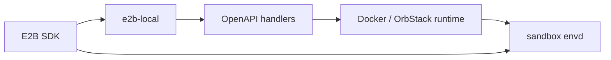

# 从 E2B API 到本地 Docker / OrbStack：设计 e2b-local

E2B 的核心价值是提供一套标准化的 sandbox API，让 SDK 可以创建沙箱、执行命令、读写文件，并把这些能力包装成开发者友好的接口。

`e2b-local` 的目标是把这套协议入口落到本地执行环境：Docker 容器或 OrbStack Linux VM。SDK 面向的是同一个 gateway，真正的运行时细节由本地 backend 处理。

## 核心目标

这个项目不是简单转发 HTTP 请求，而是实现一个本地 E2B 协议 gateway：

- 兼容 E2B SDK 请求格式和响应格式。
- 支持标准 sandbox 生命周期接口，比如 create、list、get、kill、pause、resume、connect、logs。
- 支持 metadata、state、limit 等列表过滤能力。
- 支持 commands、filesystem、PTY 这类 envd 长连接或流式数据面。
- 支持 Docker 和 OrbStack 两种本地 backend。

## 控制面和数据面

E2B API 里有两类请求。

第一类是控制面，例如：

```text
POST   /sandboxes
GET    /sandboxes
GET    /v2/sandboxes
GET    /sandboxes/:sandboxID
DELETE /sandboxes/:sandboxID
POST   /sandboxes/:sandboxID/pause
POST   /sandboxes/:sandboxID/connect
GET    /sandboxes/:sandboxID/logs
```

这些接口适合由 gateway 解析 request，调用本地 runtime，再返回兼容 E2B 的 response。

第二类是数据面，例如：

```text
commands.run(...)
files.write/read/list(...)
pty.create/sendInput/wait(...)
```

真正执行命令、读写文件、维护 PTY 流的是 sandbox 内的 `envd`。gateway 的责任是找到对应 sandbox 的 envd 地址，然后做稳定的 HTTP、WebSocket、SSE 或 ConnectRPC 代理。

推荐链路是：



这个拆分很重要：控制面由 gateway 建模，数据面使用 runtime 返回的直连 `envdURL`。

## OpenAPI 优先

项目的 request / response DTO 来自 OpenAPI schema，通过 `oapi-codegen` 生成到：

```text
internal/e2bapi/api.gen.go
```

这样做有几个好处：

- 字段、枚举、响应结构和 E2B API 保持同步。
- handler 可以显式实现，避免字段漂移。
- SDK 兼容问题可以落到 schema 和 handler 层定位。

重新生成：

```bash
go generate ./internal/e2bapi
```

项目没有直接 import SDK 内部 DTO，而是从 OpenAPI schema 生成自己的 DTO。这样可以避免 Go module 生命周期绑死，也方便后续根据 schema 变更独立演进。

## Runtime 设计

HTTP 路由层不直接关心 backend 到底是 Docker 还是 OrbStack，而是把操作收敛到 `SandboxRuntime`。

例如 runtime 负责：

- 创建 sandbox。
- 列出和读取 sandbox。
- kill、pause、resume、connect。
- 读取 logs 和 metrics。
- 创建、挂载、删除 volume。
- 创建和列出 snapshot。

backend 通过注册工厂接入：

```go
RegisterSandboxRuntimeFactory("docker", ...)
RegisterSandboxRuntimeFactory("orbstack", ...)
```

目录结构因此保持清晰：

```text
cmd/e2b-local              CLI 入口
internal/gateway           核心 gateway package
internal/backends/docker   Docker runtime
internal/backends/orbstack OrbStack runtime
internal/e2bapi            OpenAPI 生成代码
envd-bin                   随仓库管理的 Linux envd 二进制
```

## Docker Runtime

Docker backend 负责：

- 通过 Docker Engine API 创建容器。
- 按镜像架构选择 envd binary，并挂载到 `/usr/local/bin/envd`。
- 暂停、恢复、删除容器。
- 记录 envdURL、container IP、host port。
- 支持 logs、metrics、volume、snapshot 等本地实现。
- 重启后扫描带 `e2b.gateway.*` label 的容器，恢复 sandbox 映射。

典型配置：

```yaml
runtime:
  type: "docker"
```

Docker templates 默认从本机已有 tag 的 Docker images 发现。gateway 不会自动 pull 镜像；创建 sandbox 前需要先在本机 pull、build 并 tag 好对应镜像。

`docker.platform` 默认不需要配置。Docker 会选择镜像平台，gateway 再 inspect 选中的镜像架构，并自动挂载 `envd-bin/envd-linux-amd64` 或 `envd-bin/envd-linux-arm64`。只有需要强制某个平台，或需要使用自定义 envd binary 时，才需要显式配置 `docker.platform` / `docker.envd_binary`。

envd 在容器内固定监听 `49983`；Docker 会为每个 sandbox 自动分配独立的 localhost host port，避免多个 sandbox 争抢同一个 envd host port。

## OrbStack Runtime

OrbStack backend 负责：

- 把现有 OrbStack machine 暴露为 template。
- 创建 sandbox 时 clone template machine。
- 把配置的 envd binary 复制进 VM。
- 在 VM 内安装并启动 envd systemd service。
- 用 OrbStack selective mount 暴露 volume。
- 通过 `orb clone` 创建 snapshot。

典型配置：

```yaml
runtime:
  type: "orbstack"

orbstack:
  orb_binary: "/usr/local/bin/orb"
  machine_name_prefix: "e2b-sandbox-"
  envd_binary: "envd-bin/envd-linux-arm64"
  envd_port: 49983
  volume_host_path: "~/.e2b-local/volumes"
```

当 `orbstack.isolated: true` 时，sandbox VM 不再看到完整 macOS 文件系统，只能看到按请求挂载的 volume 目录。

## envd 直连

E2B SDK 的 commands/filesystem/PTY 并不是普通 JSON API。它们会访问 sandbox 的 envd，并使用 streaming、ConnectRPC 或 WebSocket。

Docker runtime 创建容器后返回 Docker 分配的 localhost envd URL；OrbStack runtime 创建 VM 后返回 VM 的 envd URL。SDK 后续的 command、file、pty 请求直接访问该地址。

## envd-bin 为什么要进仓库

Docker 和 OrbStack runtime 都需要在 sandbox 内启动 Linux 版 `envd`。

为了让项目可发布、可复现，`envd-bin` 目录随仓库管理：

```text
envd-bin/envd-linux-amd64
envd-bin/envd-linux-arm64
```

Docker 模式会根据镜像架构自动把对应二进制 bind-mount 到容器内。OrbStack 模式会把配置的二进制复制到 VM 内再安装 service。只有需要 override 时，Docker 才需要显式配置路径：

```yaml
docker:
  # optional override
  # envd_binary: "envd-bin/envd-linux-amd64"

orbstack:
  envd_binary: "envd-bin/envd-linux-arm64"
```

路径会按配置文件所在目录解析成绝对路径，避免依赖某个开发者机器上的硬编码路径。

## 验证方式

常规测试：

```bash
go test ./...
```

可选 SDK 集成测试：

```bash
go test -tags=js_sdk_integration -run TestJSSDKGatewaySmoke -count=1 -v

go test -tags=go_sdk_integration -run 'TestGoSDKGatewayMVP|TestGoSDKGatewayFilesystemDirectEnvd|TestGoSDKGatewayVolumeLifecycle' -count=1 -v
```

SDK 集成测试会读取 `config.yaml`，当 Docker、OrbStack、envd、Node 或 SDK 依赖不可用时会自动跳过。

## 小结

`e2b-local` 的设计重点是把 E2B 的协议边界理清楚：

- 控制面用 OpenAPI DTO 和显式 handler 建模。
- 数据面使用 runtime 返回的 envd URL 直连。
- Docker 和 OrbStack backend 独立实现。
- `envd-bin` 进入仓库，避免发布后依赖开发者本机路径。
- SDK 不需要感知底层运行在容器还是 VM。

后续可以继续补强多租户隔离、数据库持久化、HA、文件同步，以及更多 Docker/OrbStack 生命周期边界测试。
