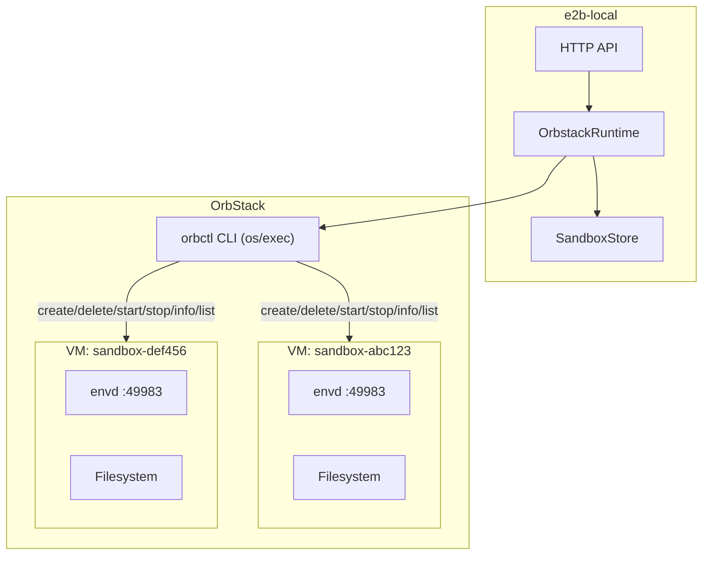

# OrbStack VM Backend Technical Implementation Plan

## Architecture Overview

OrbStack 后端与 Docker 后端的根本区别在于：沙箱运行在完整的 Linux 虚拟机中，而非容器。每个 sandbox 对应一个独立的 OrbStack machine，envd 以 systemd service 形式运行在 VM 内部。



## Key Design Decisions

### 1. VM 生命周期管理方式：纯 CLI

**选择：全部通过 `orbctl` CLI 命令管理（`os/exec` 调用）**

理由：
- `orbctl` CLI 是 OrbStack 官方稳定接口，覆盖完整 VM 生命周期
- CLI 输出支持 `-f json`，结构化解析可靠
- sconrpc 是内部协议，API 不稳定且功能有限（仅 ListContainers），第一期不使用
- 不引入额外通信协议依赖，降低维护复杂度

### 2. envd 部署方式

**选择：gateway 在 sandbox 初始化阶段直接把 `envd` copy/push 进 VM**

当前实现里，gateway 会在 machine 启动并进入配置阶段后，先把本机的 Linux `envd` binary 直接复制到 VM 临时路径，再安装到 `/usr/local/bin/envd` 并注册 systemd service。这样 `envd` 不依赖 `/mnt/mac`，volume 挂载则继续独立处理。

gateway 现在始终把每个请求到的 volume 宿主目录单独加入 OrbStack machine 的 selective mounts，不再依赖 `/mnt/mac` 暴露 volume。`orbstack.isolated: true` 只控制沙箱 VM 是否还能看到其余默认的 macOS 文件系统视图。

envd binary 路径：`envd-bin/envd-linux-arm64`（配置加载后会按配置文件目录解析为绝对路径）

### 3. 网络连接方式

**选择：优先使用 `orb info -f json` 返回的 VM IP + 固定端口，`.orb.local` 仅做兜底**

- 每个 VM 的 envd 监听 `0.0.0.0:49983`
- 从宿主机优先通过 `http://<vm-ip>:49983` 访问
- `.orb.local` 在 OrbStack 中更接近内置代理入口，不适合承载 `49983` 这类自定义端口的直连流量，因此不作为主路径

### 4. Template 系统映射

| Docker 概念 | OrbStack 等价 |
|---|---|
| Docker Image | Distro + Version + Cloud-init Config |
| `docker pull` | `orbctl create` (首次创建) |
| `docker commit` (snapshot) | `orbctl clone` (克隆 VM) |
| Image Labels | cloud-init metadata + 命名约定 |

**Template 定义方式**：YAML 配置文件中定义 template -> (distro, version, cloud-init-path) 映射表。

---

## Implementation Plan

### Phase 1: OrbStack CLI Client

文件：`internal/backends/orbstack/vm_client.go`（直接放在 orbstack backend 包内，不修改现有 `internal/orbctl`）

封装 `orbctl` CLI 的所有 VM 操作，纯 `os/exec` 实现：

```go
type VMClient struct {
    orbBinary string     // path to orb/orbctl binary, default "/usr/local/bin/orb"
    logger    *log.Logger
}

// VM lifecycle via CLI execution (os/exec)
func (c *VMClient) CreateVM(ctx context.Context, req CreateVMRequest) error
func (c *VMClient) DeleteVM(ctx context.Context, name string) error
func (c *VMClient) StartVM(ctx context.Context, name string) error
func (c *VMClient) StopVM(ctx context.Context, name string) error
func (c *VMClient) GetVMInfo(ctx context.Context, name string) (VMInfo, error)
func (c *VMClient) ListVMs(ctx context.Context) ([]VMInfo, error)
func (c *VMClient) CloneVM(ctx context.Context, source, dest string) error
func (c *VMClient) RunCommand(ctx context.Context, machine string, cmd []string) ([]byte, error)

type CreateVMRequest struct {
    Name       string
    Distro     string   // e.g. "ubuntu"
    Version    string   // e.g. "noble"
    Arch       string   // e.g. "arm64"
    Memory     string   // e.g. "4G"
    CPUs       string   // e.g. "2"
    Disk       string   // e.g. "64G"
    UserData   string   // cloud-init file path (absolute)
    Isolated   bool
}

type VMInfo struct {
    ID      string `json:"id"`
    Name    string `json:"name"`
    State   string `json:"state"`   // "running", "stopped", "creating"
    Image   VMImage `json:"image"`
}

type VMImage struct {
    Distro  string `json:"distro"`
    Version string `json:"version"`
    Arch    string `json:"arch"`
}
```

CLI 命令映射：
- `CreateVM` -> `orbctl create [--arch] [--memory] [--cpus] [--disk] [-c user-data] <distro>:<version> <name>`
- `DeleteVM` -> `orbctl delete -f <name>`
- `StartVM` -> `orbctl start <name>`
- `StopVM` -> `orbctl stop <name>`
- `GetVMInfo` -> `orbctl info -f json <name>` (解析 JSON)
- `ListVMs` -> `orbctl list -f json` (解析 JSON array)
- `CloneVM` -> `orbctl clone <source> <dest>`
- `RunCommand` -> `orbctl run -m <machine> <cmd...>`

所有方法统一通过 `exec.CommandContext` 实现，支持 context 超时/取消。

### Phase 2: Cloud-init Template

文件：`internal/backends/orbstack/cloud_init.go`

为沙箱 VM 生成 cloud-init user-data：

```yaml
#cloud-config
packages:
  - curl

write_files:
  - path: /etc/systemd/system/envd.service
    content: |
      [Unit]
      Description=E2B Environment Daemon
      After=network-online.target
      Wants=network-online.target

      [Service]
      Type=simple
      ExecStart=/usr/local/bin/envd -isnotfc -port 49983
      Restart=always
      RestartSec=1

      [Install]
      WantedBy=multi-user.target

runcmd:
  - install -m 0755 /tmp/e2b-local-envd /usr/local/bin/envd
  - systemctl daemon-reload
  - systemctl enable envd
  - systemctl start envd
```

支持动态生成：基于 template 配置注入 `start_cmd`、env vars、用户自定义 packages 等。

### Phase 3: OrbStack Runtime 实现

文件：`internal/backends/orbstack/runtime.go`

```go
package orbstackbackend

type OrbstackRuntimeConfig struct {
    OrbBinary            string            `yaml:"orb_binary"`
    MachineNamePrefix    string            `yaml:"machine_name_prefix"`
    DefaultDistro        string            `yaml:"default_distro"`
    DefaultVersion       string            `yaml:"default_version"`
    DefaultArch          string            `yaml:"default_arch"`
    DefaultMemory        string            `yaml:"default_memory"`
    DefaultCPUs          string            `yaml:"default_cpus"`
    DefaultDisk          string            `yaml:"default_disk"`
    EnvdBinary           string            `yaml:"envd_binary"`
    EnvdPort             int               `yaml:"envd_port"`
    HealthTimeoutSeconds int               `yaml:"health_timeout_seconds"`
    CloudInitTemplate    string            `yaml:"cloud_init_template"`
    Templates            map[string]OrbstackTemplateConfig `yaml:"templates"`
}

type OrbstackTemplateConfig struct {
    Distro      string `yaml:"distro"`
    Version     string `yaml:"version"`
    Arch        string `yaml:"arch"`
    Memory      string `yaml:"memory"`
    CPUs        string `yaml:"cpus"`
    Disk        string `yaml:"disk"`
    Packages    []string `yaml:"packages"`
    UserData    string `yaml:"user_data"`
    StartCmd    string `yaml:"start_cmd"`
    BaseMachine string `yaml:"base_machine"`  // clone from this VM for fast creation
}

type OrbstackRuntime struct {
    cfg      OrbstackRuntimeConfig
    vmClient *VMClient   // CLI-based VM lifecycle client
    logger   *log.Logger
}

func init() {
    gateway.RegisterSandboxRuntimeFactory("orbstack", func(cfg gateway.Config, logger *log.Logger) (gateway.SandboxRuntime, error) {
        return NewOrbstackRuntime(cfg.Orbstack, logger)
    })
}
```

**核心方法实现逻辑**：

#### CreateSandbox

1. 根据 `templateID` 查找 OrbstackTemplateConfig（或使用默认 distro）
2. 如果 template 有 `base_machine`（如 `ubuntu-2404`），直接 `orbctl clone <base_machine> <sandbox-name>`
3. 否则生成 cloud-init YAML，执行 `orbctl create <distro>:<version> <machine-name> -c <cloud-init>`
4. 等待 VM 状态变为 `running`
5. 等待 envd 健康检查通过（`GET http://<vm-ip>:49983/health`）
6. 返回 `SandboxRuntimeInfo{EnvdURL: "http://<vm-ip>:49983", ...}`

#### DeleteSandbox

1. 执行 `orbctl delete -f <machine-name>`

#### PauseSandbox / ResumeSandbox

1. `orbctl stop <machine-name>` / `orbctl start <machine-name>`
2. Resume 后等待 envd 健康检查恢复

#### ListTemplates

1. 从配置中返回已定义的 templates 列表
2. 可选：扫描现有 VM 发现 cloned templates

### Phase 4: VolumeRuntime（跨 VM 文件共享）

**策略**：创建一个专用的 volume-store VM，所有 volume 数据存储在其中。Sandbox VM 通过 OrbStack 的 `/mnt/machines/` 能力访问 volume 数据。

```
架构:
  volume-store VM (e2b-volume-store)
    /data/volumes/<volume-id>/   <-- volume 数据实际存储位置

  sandbox VM (e2b-sandbox-xxx)
    /mnt/machines/e2b-volume-store/data/volumes/<volume-id>/  <-- 跨 VM 访问
    /volumes/<volume-id>/  <-- symlink 或 bind mount 到上面的路径
```

实现：

```go
// VolumeRuntime implementation
func (r *OrbstackRuntime) CreateVolume(ctx context.Context, name string) (RuntimeVolume, error) {
    // orbctl run -m <volume-store> mkdir -p /data/volumes/<volume-id>
    // volume-id = generated UUID
}

func (r *OrbstackRuntime) DeleteVolume(ctx context.Context, volumeID string) (bool, error) {
    // orbctl run -m <volume-store> rm -rf /data/volumes/<volume-id>
}

func (r *OrbstackRuntime) ListVolumes(ctx context.Context) ([]RuntimeVolume, error) {
    // orbctl run -m <volume-store> ls /data/volumes/
    // + read metadata from the host volume directory metadata store
    //   (current macOS implementation prefers readable directory names from volume name,
    //    keeps volumeID in a directory xattr, and migrates old .e2b-meta.json / id-directory layouts on read)
}

func (r *OrbstackRuntime) GetVolume(ctx context.Context, volumeID string) (RuntimeVolume, error) {
    // read metadata from the host volume directory metadata store
}
```

Sandbox 创建时挂载 volume：
- cloud-init 中 runcmd 添加 symlink：`ln -s /mnt/machines/<volume-store>/data/volumes/<id> <mountPath>`
- 或 clone 后通过 `orbctl run -m <sandbox>` 创建 symlink

配置新增：
```yaml
orbstack:
  volume_store_machine: "e2b-volume-store"  # dedicated VM for volume storage
  volume_base_path: "/data/volumes"         # path inside volume-store VM
```

初始化：首次调用 volume 相关接口时检查 volume-store VM 是否存在，不存在则自动创建；避免 gateway 启动时被 volume-store 的首次建机阻塞。

### Phase 5: 其他可选 Capability 接口

#### SandboxRuntimeInspector

```go
func (r *OrbstackRuntime) InspectSandbox(ctx context.Context, info SandboxRuntimeInfo) (SandboxRuntimeInspection, error) {
    // orbctl info <machine-name> -f json
    // 映射 state: "running" -> exists=true, "stopped" -> exists=true/paused
}
```

#### SandboxRuntimeRestorer

```go
func (r *OrbstackRuntime) RestoreSandboxes(ctx context.Context) ([]SandboxRecord, error) {
    // orbctl list -f json
    // 过滤 name prefix = machine_name_prefix 的 VMs
    // 重建 SandboxRecord
}
```

#### SandboxRuntimeSnapshotter (via orbctl clone)

```go
func (r *OrbstackRuntime) CreateSandboxSnapshot(ctx context.Context, info SandboxRuntimeInfo, name string) (string, error) {
    // orbctl clone <source-machine> <snapshot-machine-name>
}
```

### Phase 6: 配置集成

修改 `internal/gateway/config.go`：

```go
type Config struct {
    // ... existing fields ...
    Orbstack OrbstackRuntimeConfig `yaml:"orbstack"`
}
```

在 `Validate()` 中增加：
```go
case "orbstack":
    // validated in factory
```

### Phase 7: Main 入口注册

修改 `cmd/e2b-local/main.go`：

```go
import (
    _ "e2b-local/internal/backends/orbstack"
)
```

---

## Configuration Example

```yaml
runtime:
  type: orbstack

orbstack:
  orb_binary: /usr/local/bin/orb
  machine_name_prefix: "e2b-sandbox-"
  default_distro: ubuntu
  default_version: "noble"
  default_arch: arm64
  default_memory: "2G"
  default_cpus: "2"
  default_disk: "16G"
  envd_binary: envd-bin/envd-linux-arm64
  envd_port: 49983
  health_timeout_seconds: 60
  cloud_init_template: ""  # optional custom template path
  volume_store_machine: "e2b-volume-store"
  volume_base_path: "/data/volumes"

  templates:
    base:
      distro: ubuntu
      version: "noble"
      base_machine: "ubuntu-2404"  # clone from existing VM for fast creation
    python:
      distro: ubuntu
      version: "noble"
      packages:
        - python3
        - git
      user_data: "./templates/python-cloud-init.yaml"
      start_cmd: "python3 -m http.server 8080"
    node:
      distro: ubuntu
      version: "noble"
      user_data: "./templates/node-cloud-init.yaml"
```

---

## Key Differences from Docker Backend

| Dimension | Docker | OrbStack VM |
|---|---|---|
| Isolation level | Container (namespace) | Full VM (kernel) |
| Startup time | ~2-5s | ~15-30s (first boot + cloud-init) |
| Resource overhead | Low (~50MB per sandbox) | Medium (~200MB per VM) |
| envd deployment | Bind mount from host | Gateway push/copy into VM, then install as local binary |
| Networking | Docker port mapping | VM direct IP + fixed port |
| Snapshots | docker commit | orbctl clone |
| Template system | Docker images | Distro + cloud-init |
| Max concurrency | ~50+ containers | ~20 VMs (depends on host RAM) |
| Filesystem isolation | Shared kernel, layered FS | Independent disk per VM |
| Volume sharing | Docker named volumes | macOS host directories via selective mounts |

---

## Startup Time Optimization Strategies

1. **Pre-warm buffer**: 预创建 N 个 "idle" VM 待分配（作为 OrbStack backend 自己的预热缓冲）
2. **Clone from golden image**: 首次创建 base VM 并完成 cloud-init，后续用 `orbctl clone` 创建（秒级）
3. **Persistent VMs**: sandbox timeout 后不删除 VM，仅 stop，复用时 start（跳过 cloud-init）

建议初期实现 strategy 2（clone-based），利用已有的 `ubuntu-2404` VM 作为 golden image：

```yaml
orbstack:
  templates:
    base:
      distro: ubuntu
      version: "noble"
      base_machine: "ubuntu-2404"  # existing VM, clone from this for fast creation
```

测试时可直接使用 `ubuntu-2404` 这个已创建的 VM 进行验证，后续 CreateSandbox 通过 `orbctl clone ubuntu-2404 <sandbox-name>` 实现秒级创建。

---

## File Structure

```
internal/backends/orbstack/
  runtime.go              # OrbstackRuntime: SandboxRuntime + optional interfaces
  runtime_test.go         # Unit tests with mock CLI
  cloud_init.go           # Cloud-init YAML generation from template config
  cloud_init_test.go      # Template rendering tests
  vm_client.go            # VMClient: pure os/exec wrapper for orbctl CLI
  vm_client_test.go       # Tests with exec mock
  config.go               # OrbstackRuntimeConfig + OrbstackTemplateConfig + validation
```

注意：不修改现有 `internal/orbctl/` 包（sconrpc client），保持其独立性供未来使用。

---

## Testing Strategy

1. **Unit tests**: Mock `orbctl` CLI output, test parsing and state machine
2. **Integration tests**: 实际创建/删除 OrbStack VM（tagged `//go:build integration`），使用 `ubuntu-2404` 作为测试基础
3. **E2E tests**: 通过 e2b SDK 连接 OrbStack-backed sandbox

---

## Risk and Mitigation

| Risk | Impact | Mitigation |
|---|---|---|
| VM 启动慢 (15-30s) | 用户体验差 | Clone-based fast creation, pre-warm buffer |
| OrbStack CLI 接口变更 | Runtime 崩溃 | Version check + graceful error handling |
| macOS only | 无法在 CI/Linux 运行 | Build tag `//go:build darwin`，CI 跳过 |
| 并发创建资源竞争 | VM 创建失败 | Semaphore 限制并发创建数 |
| envd binary 架构不匹配 | VM 内无法运行 | 校验 binary arch vs VM arch |
